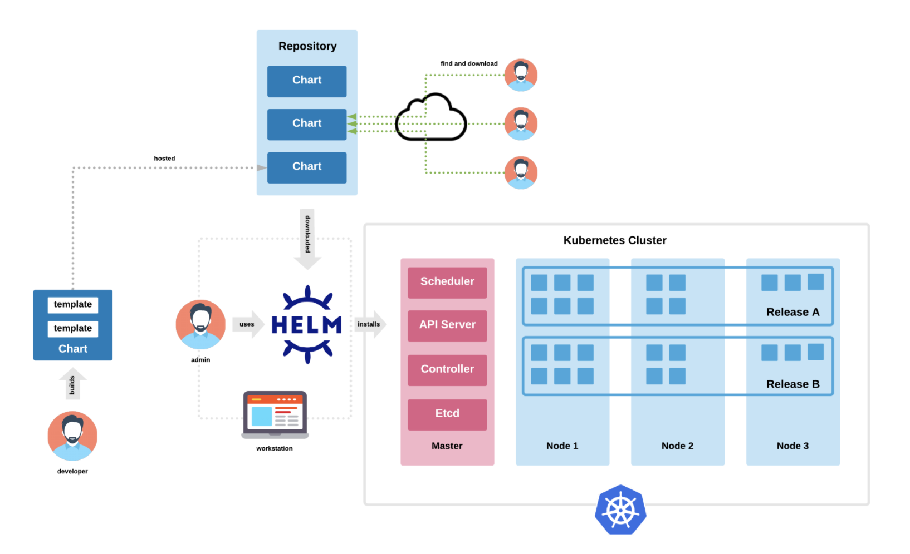
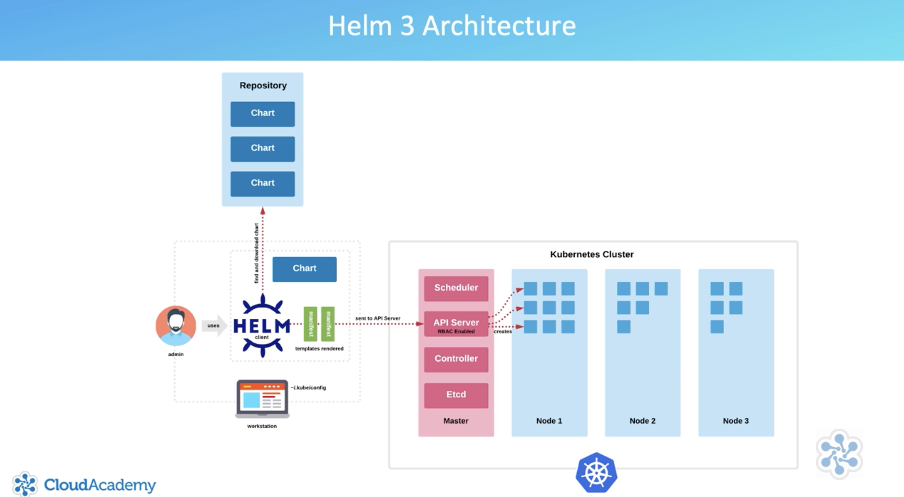

# Overview

- Helm is the application package manager for kubernetes.




## Why Helm?
- Helm can help simplify deployment experience.
- It helps
    - How to parameterize?
    - How to add in application lifecycle hook?
    - How to manage versions of related resources?

## Benefits
- Using a single command `install` to deploy and `uninstall` to remove resources
- Using a single chart multiple times
- Using `--set` to customize behavior of application
- Using commands `upgrade`, `rollback` to version resources
- And it also supports creation of skeleton charts using `create` command

## Terminology
- `Chart`:
    - A package format used by helm.
    - Consists of a specific folder strucutre including several files and templates
    - Used to deploy resources in the cluster
    - Packaged into an archive and put into a repository
- `Repository`:
    - A http web server that stores and serves host several charts
    - Allow chart to be distributed and share
- `Template`:
    - Are used in a chart to make deployment more general and reusable
    - Parameterize a resource file to be customizable
    - Can be used to deploy in several environment by providing different arguments
- `Releases`:
    - When you deploy a chart in your cluster, helm create a release for it.
    - An instance for a chart
    - Can have multiple releases using the same chart
    - A release can be upgraded or rollback
    - A release maintain a history of change of its own revision

## Architecture
- Directly talk to the API server after helm 3 (Bucause of the use of RBAC)
- The same way that kubectl talk to API server
- The templates are rendered on the client side to raw kubernetes manifest file


## Installation
```bash
$ brew install helm

$ source <(helm completion zsh)
```

## References
- https://cloudacademy.com/course/introduction-to-helm-1034