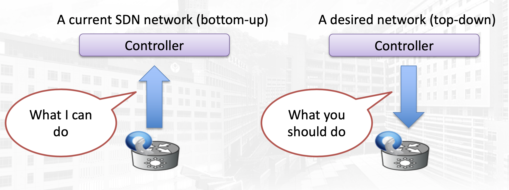

# P4 Overview

P4 = Protocol-Independent Packet Processors

## SDN
- Network devices are divided into control and data planes.
- The controller install rules into forwarding table in switches to control traffic routing

### Limitation
- The packet fields that can be matched are limited by OpenFlow protocol.
- The actions we can take on packets are also limited.
- OpenFlow switches reserve TCAM space for all possible fields --> waste TCAM space.
- The design of hardware (to support more actions) (limited by Openflow protocol) is also hard to change because it’s too expensive.

 

## P4
- P4 is a language to describe what a switch should do.
- Bottom-up design (SDN) V.S. a top-down design (P4)
- SDN --> programmable control plane
- P4 --> programmable data plane
- Goals:
    - Reconfigurability
    - Protocol-independence
    - Target Independence (Can run on any level (sw and hw), but this has not been achieved now)\
- Note: Since we still need a way to communicate between data plane and control plane, we need to define a protocol other than OpenFlow.

### Version
- Before 2017: P414
- After 2017: P416
- They have very different syntax.

### Benefits
- **New Features** – Add new protocols
- **Reduce complexity** – Remove unused protocols
- **Efficient use of resources** – flexible use of tables
- **Greater visibility** – New diagnostic techniques, telemetry, etc.
- **SW style development** – rapid design cycle, fast innovation, fix data plane bugs in the field
- **You keep your own ideas**

### Hardwares
- Let control plane and data plane can be developed by the same person.
- New custom ASICs can achieve such flexibility at terabit speeds. (Kangaroo INFOCOM ’10, SDN Chip
SIGCOMM ’13, Intel FM6000 switch silicon)
- Some switches are more programmable than others:
    - FPGA (Xilinx, Altera, Corsa)
    - NPU (Ezchip, Netronome)
    - CPU (OVS, ...)

### Processing Steps
- In traditional switches, these 3 steps are bundled and can not modify.

## References
- This note is based on NTU course - [Network Virtualization and Security](https://nol.ntu.edu.tw/nol/coursesearch/print_table.php?course_id=942%20U0710&class=&dpt_code=9420&ser_no=50698&semester=110-1&lang=CH)