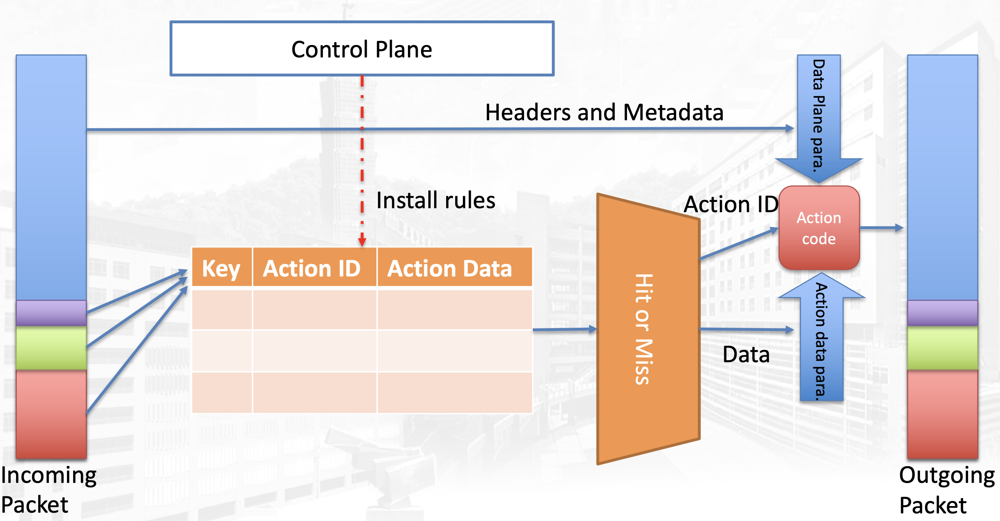
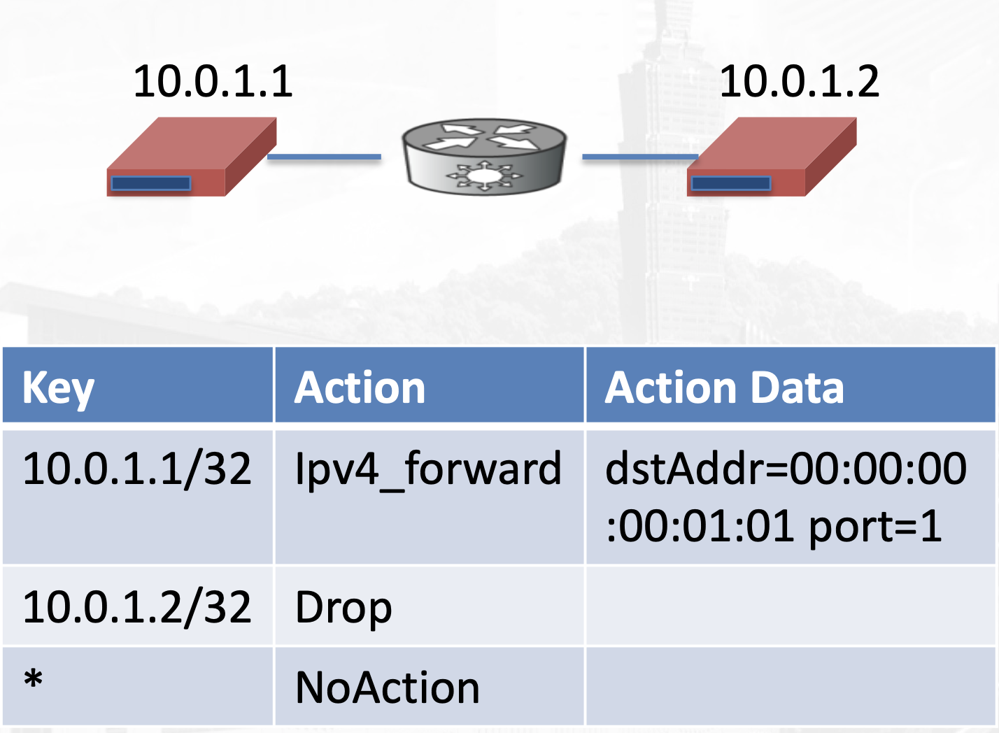

# P4 Programming

## P4 Program Template
- It looks like a combination of verilog and c++.
```c++
#include <core.p4>
#include <v1model.p4>

/* HEADERS */
struct metadata { ... }
struct headers {
ethernet_t ethernet;
ipv4_t ipv4;
}

/* PARSERS */
parser MyParser(packet_in packet,
out headers hdr,
inout metadata meta,
inout standard_metadata_t smeta) {
...
}
 
/* CHECKSUM VERIFICATION */
control MyVerifyChecksum(in headers hdr,
...
}

/* INGRESS PROCESSING */
control MyIngress(inout headers hdr,
inout metadata meta,
inout standard_metadata_t std_meta) {
...
}

/* EGRESS PROCESSING */
control MyEgress(inout headers hdr,
inout metadata meta,
inout standard_metadata_t std_meta) {
...
}

control MyComputeChecksum(inout headers hdr, 
inout metadata meta) {
...
}

/* DEPARSER */
control MyDeparser(inout headers hdr,
inout metadata meta) {
...
}

/* SWITCH */
V1Switch(
MyParser(),
MyVerifyChecksum(),
MyIngress(),
MyEgress(),
MyComputeChecksum(),
MyDeparser()
) main;
```

## V1Model Standard Metadata
- It is the standard metadata that V1Model defines.
- **ingress_port**: the port on which the packet arrived
- **egress_spec**: the port to which the packet should be sent to (the expected port, written in ingress module, because that port may not be available)
- **egress_port**: the port on which the packet is departing from (read only in egress pipeline) (the actual port, checked by egress module)
```c++
struct standard_metadata_t { 
bit<9> ingress_port;
bit<9> egress_spec;
bit<9> egress_port;
bit<32> clone_spec;
bit<32> instance_type;
bit<1> drop;
bit<16> recirculate_port;
bit<32> packet_length;
bit<32> enq_timestamp;
bit<19> enq_qdepth;
bit<32> deq_timedelta;
bit<19> deq_qdepth;
bit<48> ingress_global_timestamp;
bit<32> lf_field_list;
bit<16> mcast_grp;
bit<1> resubmit_flag;
bit<16> egress_rid;
bit<1> checksum_error;
}
```

## P416 Types

### Basic Types
- **bit\<n\>**: Unsigned integer (bitstring) of size n
- **bit** is the same as bit<1>
- **int\<n\>**: Signed integer of size n (>=2)
- **varbit\<n\>**: Variable-length bitstring (used in tcp options)

### Header Types
- Ordered collection of members
- Denoted by `header`
- Can contain `bit<n>`, `int<n>`, and `varbit<n>`
- Byte-aligned
- Can be valid or invalid
- Provides several operations to test and set validity bit: `isValid()`, `setValid()`, and `setInvalid()`

### Other Types
- **Typedef**: Alternative name for a type
- **Struct**: Unordered collection of members (with no alignment restrictions)
- **Header Stack**: array of headers
- **Header Union**: one of several headers

### Examples
```c++
typedef bit<48> macAddr_t; 
typedef bit<32> ip4Addr_t; 

header ethernet_t { 
macAddr_t dstAddr; 
macAddr_t srcAddr;
bit<16> etherType;
}

header ipv4_t {
bit<4> version;
bit<4> ihl;
bit<8> diffserv;
bit<16> totalLen; 
bit<16> identification; 
bit<3> flags;
bit<13> fragOffset; 
bit<8> ttl;
bit<8> protocol; 
bit<16> hdrChecksum; 
ip4Addr_t srcAddr; 
ip4Addr_t dstAddr;
}

/* Architecture */
struct standard_metadata_t { bit<9> ingress_port;
bit<9> egress_spec;
bit<9> egress_port;
bit<32> clone_spec; bit<32> instance_type; bit<1> drop;
bit<16> recirculate_port; bit<32> packet_length; ...
}
/* User program */
struct metadata {
...
}
struct headers {
ethernet_t ethernet;
ipv4_t ipv4;
}
```

## P416 Parsers
- Parsers are functions that map packets into headers and metadata, written in a state machine style
- Every parser has three predefined states: `start`, `accept`, `reject`
- Other states may be defined by the programmer
- In each state, execute zero or more statements, and then transition to another state (loops are OK)


### Examples
- P416 has a select statement that can be used to branch in a parser
- In parsers it is often necessary to branch based on some of the bits just parsed
- For example, etherType determines the format of the rest of the packet
- Match patterns can either be literals or simple computations such as masks
- `packet_in` type has self-defined extract methods to extract headers for you
```c++
/* From core.p4 */
extern packet_in {
void extract<T>(out T hdr);
void extract<T>(out T variableSizeHeader, in bit<32> variableFieldSizeInBits);
T lookahead<T>();
void advance(in bit<32> sizeInBits); bit<32> length();
}
```
```c++
parser MyParser(packet_in packet,
out headers hdr,
inout metadata meta, header
inout standard_metadata_t std_meta) { 
    state start {
        transition parse_ethernet;
    }

    state parse_ethernet { 
        packet.extract(hdr.ethernet); 
        transition select(hdr.ethernet.etherType) { 
            0x800: parse_ipv4;
            default: accept;
        }
    }
}
```
```c++
parser MyParser(packet_in pkt,
out headers hdr,
inout metadata meta, header
inout standard_metadata_t std_meta) { 
    state start {
        transition eth;
    }

    state eth {
        pkt.extract(eth);
        transition select(eth.ethType) {
            0x800: ip;
            _: reject;
            // default: accept
        }
    }

    state ip {
        pkt.extract(ipv4);
        transition accept;
    }
}
```

## P416 Controls
- `apply` is the entry point of a control block
- `action` is just like function, which can be invoked by `apply`, which can be declared inside a control or globally
- Many standard arithmetic and logical operations are supported:
    - `+`, `-`, `*`
    - `~` ,`&`, `|`, `^`, `>>`, `<<`
    - `==`, `!=`, `>`, `>=`, `<`, `<=`
    - No division/modulo
- Non-standard operations (may not be supported):
    - Bit-slicing: `[m:l]` (works as l-value too)
    - Bit Concatenation: `++`

### Example: Reflector
- This a reflector (echo) example.
- It just swap the mac address and the port, achieving an echo operation
```c++
control MyIngress(inout headers hdr, inout metadata meta,
    inout standard_metadata_t std_meta) 
{ 
    action swap_mac(inout bit<48> src, inout bit<48> dst) {
        bit<48> tmp = src;
        src = dst;
        dst = tmp;
    }

    apply {
        swap_mac(hdr.ethernet.srcAddr, hdr.ethernet.dstAddr);
        std_meta.egress_spec = std_meta.ingress_port; 
    }
}
```

## Table Matching
- P4 only define the schema of the table
- `key`: like matching rules (ip, port, …)
- `action id`: like swap_mac function
- `action data`: like arguments for swa_mac
- `action` can see all metadata because actions are defined in the module (like closure)
- Control plane may be local or remote



### Example: IPv4_LPM Table
- This is a ipv4 longest prefix matching (LPM) example.
- Data Plane (P4) Program
    - Defines the format of the table
        - Key 
        - Action
        - Action data
    - Performs the lookup
    - Executes the chosen action
- Control Plane (IPstack, Routing protocols)
    - Populates table entries with specific information
        - Based on the configuration
        - Based on automatic discovery
        - Based on protocol calculations
- Actions can have two different types of parameters
    - Directional (from the Data Plane)
    - Directionless (from the Control Plane)
- Actions that are called directly:
    - Only use directional parameters
- Actions used in tables:
    - Typically use directionless parameters
    - May sometimes use directional parameters too



```c++
/* core.p4 */
match_kind {
    exact,
    ternary,
    lpm
}

/* core.p4 */
action NoAction() { }

/* basic.p4 */
/* mark_to_drop() is defined in core.p4 */
action drop() {
    mark_to_drop();
}

/* basic.p4 */
action ipv4_forward(macAddr_t
    dstAddr,
    bit<9> port) {
    ...
}

table ipv4_lpm {
    /* There are several modes other than lpm */
    key = {
        hdr.ipv4.dstAddr: lpm;
    }
    
    actions = {
        ipv4_forward;
        drop;
        NoAction;
    }
    /* restrict the number of rules in the table */
    size = 1024;
    default_action = NoAction();
}

control MyIngress(
    inout headers hdr,
    inout metadata meta,
    inout standard_metadata_t standard_metadata) {
    table ipv4_lpm {
        ... 
    }

    apply { 
        ...
        /*
        - Tell switch to look for rules in the table 
        - You can apply several tables in order
        - Usually, you will use if statement to check whether this packet have some fields to match, or just skip. If you do not do this, it may fall under NoAction(), then the packet is dropped
        */
       ipv4_lpm.apply();
        ... 
    }
}
```

## P416 Deparser
- Assembles the headers back into a well-formed packet
- Expressed as a control function
    - No need for another construct!
- `packet_out` is defined in core.p4: emit(hdr): serializes header if it is valid
- If you don’t fetch some header, like tcp, you don’t have to assemble it again
- Advantages:
    - Makes deparsing explicit but decouples from parsing
```c++
/* From core.p4 */
extern packet_out {
        void emit<T>(in T hdr);
}

/* User Program */
control DeparserImpl(packet_out packet, in headers hdr) {
    apply {
        ...
        packet.emit(hdr.ethernet);
        ...
    } 
}
```

## References
- This note is based on NTU course - [Network Virtualization and Security](https://nol.ntu.edu.tw/nol/coursesearch/print_table.php?course_id=942%20U0710&class=&dpt_code=9420&ser_no=50698&semester=110-1&lang=CH)