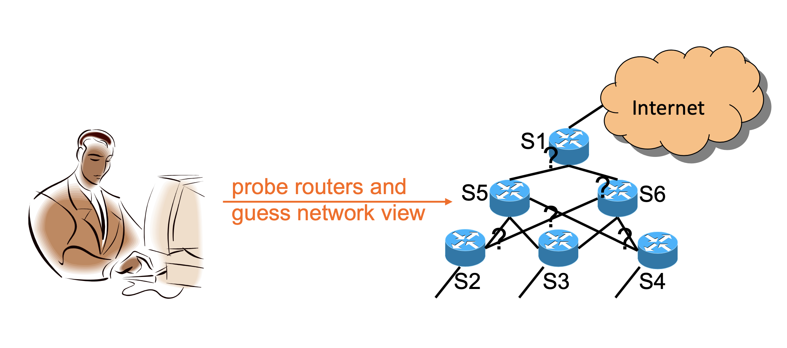
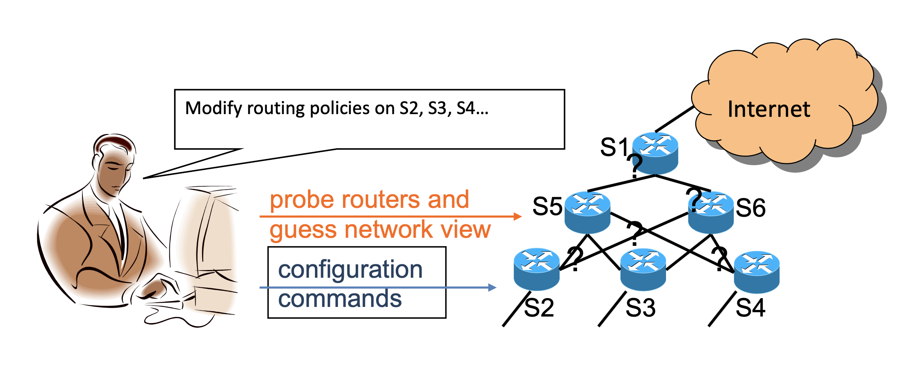
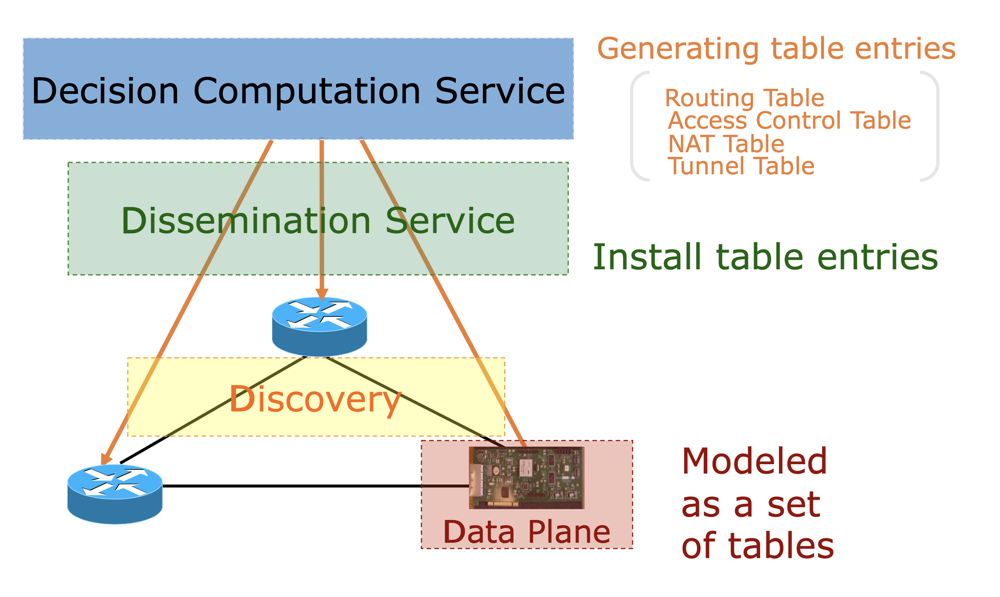

# Network Management

## Ideal 
- Managing network in a simple way
- Directly and explicitly apply policies to network
- With the information provided by the Internet itself, or directly connect to a router or intercept packets to find out the problem

## Indirect Control

### Infer network view by reverse engineering
- Probe routers to fetch configuration
- Monitor control traffic (e.g., LSAs, BGP update)
- Usually, the internal topology is hidden from the outside world.
- In traditional network, the builder and the manager of the network may be different, so it’s a big burden for management.
- You need to do testing manually and you must have some level of network background.

### Policies buried in box-centric configuration
- Many knobs to tune
- Trial and error
- Different switch have different commands interface, even the switch from the same vendor may differ, it tedious to know all these commands

### Problems
- 62% of network downtime in multi-vendor networks comes from human-error
    - A misconfiguration may be found several weeks later when a network crashed
- 80% of IT budgets is spent on maintenance and operations. 
    - Human resources is very expensive in the US, so we have to make a trade-off between devices and humans. 

### Architecture Questions to Study
- How should the functionality that controls a network be divided up?
- **Important**: everyone hates net outages
- **Practical**: solutions can be implemented without changing IP or end-hosts
- **Relevant**: trends toward separating decision-making from forwarding
- **Unsolved**: problem is not solved by running BGP/OSPF on faster servers

## SDN - Direct Controle
- Express goals explicitly
    - Security policies, QoS, egress point selection
    - Do not bury goals in box-specific configuration
    - Make policy dependencies explicit
- Design network to provide timely and accurate view
    - Topology, traffic, resource limitations
    - Give decision maker the inputs it needs
- Decision maker computes and pushes desired network state
    - FIB entries, packet filters, queuing parameters
    - Simplify router functionality
    - Add new functions without modifying/creating protocols or upgrading routers

### Architecture
- Decision Plane
    - Distributed
    - Centralized
- Dissemination Plane
    - In-band (Use the same channel for both data plane and control plane)
    - Out-of-band (Use separate Ethernet ports and links (i.e. using the traditional networks))
- Data Plane
    - Flow table entries
    - Piece of code run at every router
    - Piece of code in each packet

## References
- This note is based on NTU course - [Network Virtualization and Security](https://nol.ntu.edu.tw/nol/coursesearch/print_table.php?course_id=942%20U0710&class=&dpt_code=9420&ser_no=50698&semester=110-1&lang=CH)
- https://www.researchgate.net/post/Is-anyone-familiar-with-in-band-and-out-of-band-control-on-SDN